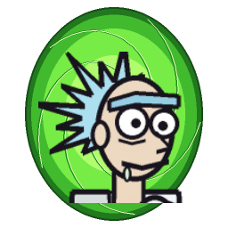

# Rick and Morty – Avventura Interdimensionale



Videogioco platform/sparatutto 2D ispirato alla serie **Rick and Morty**, scritto **da zero** in Python + pygame.
Tutta la grafica (Rick, Morty, mostri, sfondi, portali) e tutto l'audio (effetti, rutti e musiche)
sono **generati via codice**: non serve nessun file di immagini o suoni.

> Fan game **non ufficiale**, gratuito e senza scopo di lucro. Rick and Morty © Adult Swim / Williams Street.

## Come avviarlo

### Opzione 1 – Il file `.exe` (Windows, senza installare niente)
1. Vai nella scheda **Actions** di questo repository su GitHub.
2. Apri l'ultima esecuzione verde di **"Crea RickAndMorty.exe (Windows)"**.
3. In fondo, sotto **Artifacts**, scarica **RickAndMorty-Windows** (è uno zip).
4. Estrai lo zip e fai doppio clic su **RickAndMorty.exe**.

Windows potrebbe mostrare "Windows ha protetto il PC" (l'exe non è firmato):
clicca **Ulteriori informazioni → Esegui comunque**.

Puoi anche creare l'exe sul tuo PC: installa [Python](https://www.python.org/downloads/)
(spunta *Add Python to PATH*) e fai doppio clic su **`build_exe.bat`**. Troverai il gioco in `dist\RickAndMorty.exe`.

### Opzione 2 – Il file `.py`
```bash
pip install pygame
python rick_and_morty.py
```
Su Windows basta fare doppio clic su **`gioca.bat`**.

## Comandi

| Tasto | Azione |
|---|---|
| **A / D** o **Frecce** | Muoviti |
| **Spazio / W / Su** | Salta (premi di nuovo in aria = doppio salto) |
| **Giù + Salto** | Scendi da una piattaforma sottile |
| **J / Z** o **Click sinistro** | Spara col laser (mira automatica; col mouse miri tu) |
| **K / X / Shift** o **Click destro** | Pistola portale: teletrasporto (+ Su/Giù = in diagonale) |
| **H / Q** | Bevi dalla fiaschetta di Rick (+40 vita) *burp* |
| **E** | Parla con i personaggi |
| **Esc / P** | Pausa |
| **M** | Audio on/off |
| **F11** | Schermo intero |

Puoi anche saltare in testa ai nemici per schiacciarli (tranne le guardie con l'elmetto).

## Le dimensioni

1. **Dimensione Cronenberg** – mostri di carne, acido e Mr. Poopybutthole che dà consigli.
2. **Pianeta della Federazione** – i Gromflomiti e i droni sparano a vista.
3. **Le Fogne: Pickle Rick** – Rick è un sottaceto con un'armatura di ratto, al buio, da solo.
4. **La Cittadella dei Rick** – guardie Rick corazzate e droni.
5. **L'Arena dei Cromulon** – boss finale: *"MOSTRAMI COSA SAI FARE!"*

In ogni dimensione ci sono **3 Mega Semi** dorati da trovare, Schmeckles da raccogliere,
fiaschette, ricariche di fluido portale e la **scatola di Mr. Meeseeks** che evoca un aiutante.
Morty ti segue, spara e si teletrasporta da te se resta indietro.

I progressi vengono salvati automaticamente nel file `.rick_morty_avventura_save.json`
nella tua cartella utente. Nel garage, premi **Canc** due volte per azzerarli.

## File del progetto

- `rick_and_morty.py` – il gioco completo (un solo file)
- `gioca.bat` – avvia il gioco su Windows (installa pygame se manca)
- `build_exe.bat` – crea `RickAndMorty.exe` su Windows
- `tools/make_icon.py` – genera l'icona dell'eseguibile
- `.github/workflows/build-exe.yml` – crea automaticamente l'exe su GitHub
