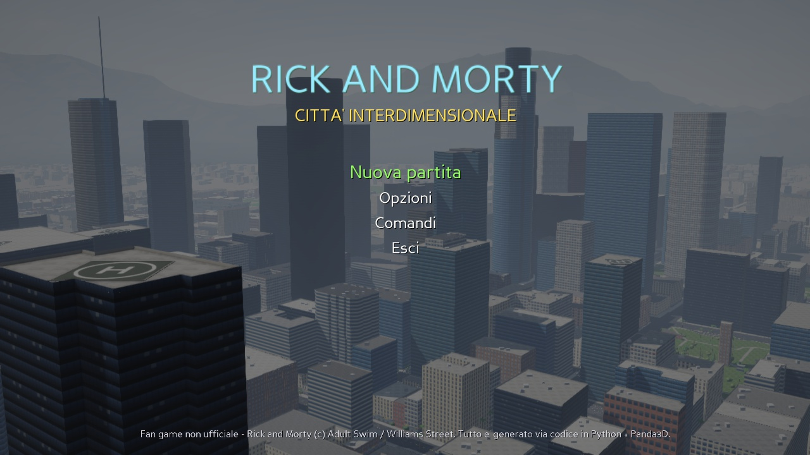
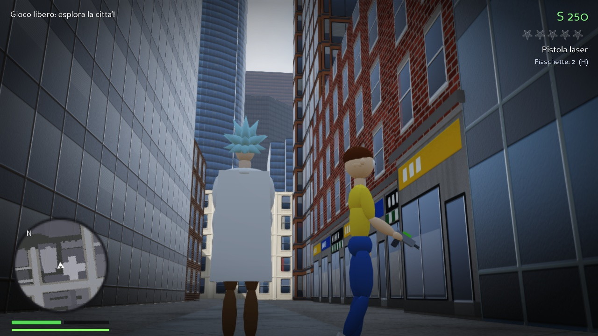
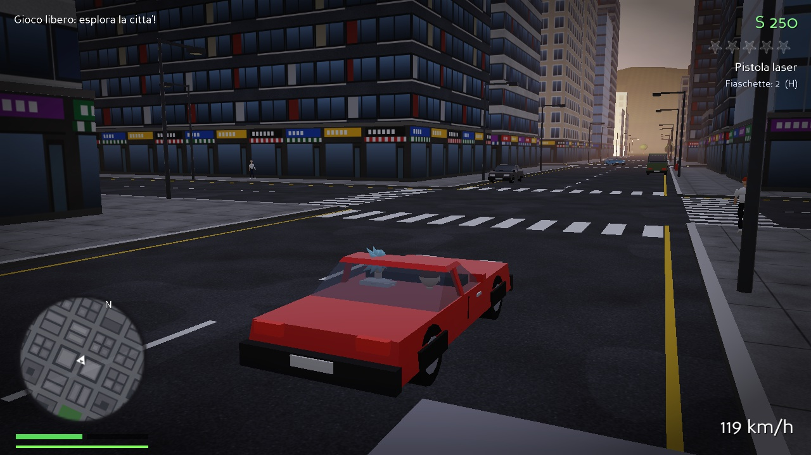
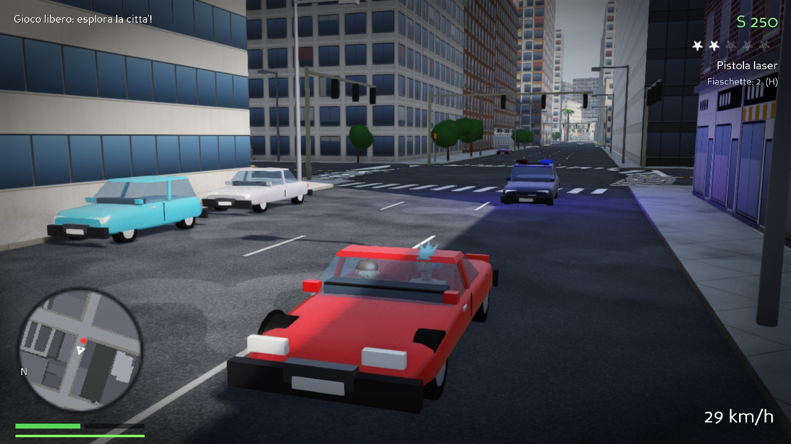
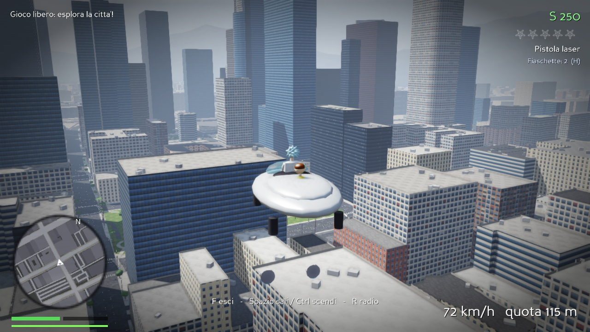
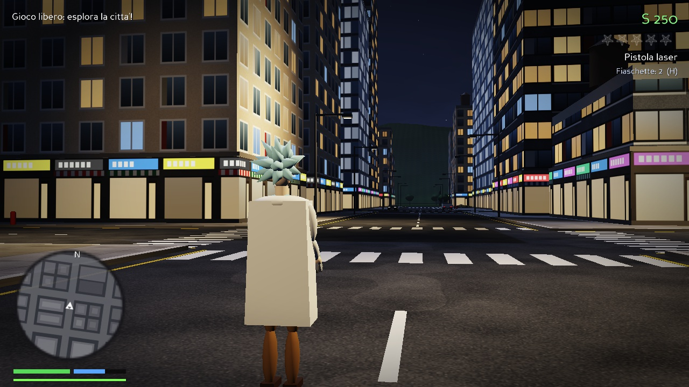
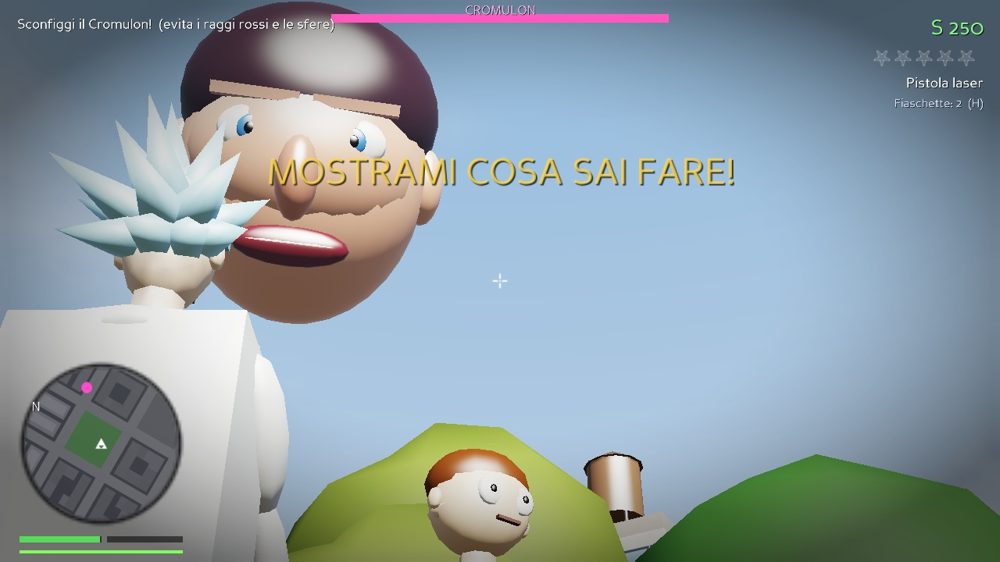

# Rick and Morty – Città Interdimensionale


Videogioco **open world 3D in stile GTA**, in **terza e prima persona**, ambientato nel mondo di
**Rick and Morty**, in una **città vera**: il centro di **Los Angeles** (la Los Santos di GTA V)
ricostruito in 3D con **strade ed edifici reali** presi da OpenStreetMap.
Scritto **da zero** in Python + Panda3D: personaggi, auto, cielo, texture, suoni e musica sono
**generati via codice**.

> Fan game **non ufficiale**, gratuito e senza scopo di lucro. Rick and Morty © Adult Swim / Williams Street.



| | |
|---|---|
|  |  |
|  |  |
|  |  |

## Cosa c'è nel gioco

- **Los Angeles vera, 2,6 km × 2,6 km**: oltre 2.600 edifici reali con la loro forma e la loro altezza
  (Wilshire Grand, U.S. Bank Tower, Aon Center, ...), più di 3.000 tratti di strada, le freeway 110 e 101,
  Pershing Square, Grand Park, i parcheggi, le piazze e 240 incroci con semaforo.
- **Strade realistiche**: larghezza calcolata dal numero di corsie, marciapiedi rialzati con il cordolo,
  doppia linea gialla e corsie tratteggiate all'americana, strisce pedonali vere, linee d'arresto,
  semafori a sbraccio che cambiano colore, lampioni, idranti, fermate dell'autobus e palme.
- **Edifici con facciate dettagliate**: grattacieli a specchio che riflettono il cielo, uffici, palazzi
  storici in pietra e mattoni, condomini, capannoni, parcheggi multipiano, negozi al piano terra,
  eliporti sui tetti dei grattacieli. Di notte le finestre si accendono una a una.
- **Grafica**: ombre del sole anche lontane (i grattacieli fanno ombra sulla città), occlusione ambientale
  (SSAO), bagliore delle luci (bloom), antialiasing (FXAA), foschia di Los Angeles, colline all'orizzonte,
  ciclo giorno/notte.
- **Terza e prima persona** (tasto **V**), a piedi e in auto.
- **Traffico vero**: le auto seguono le corsie, svoltano agli incroci e **si fermano col rosso**.
- **Pedoni** che camminano sui marciapiedi e attraversano agli angoli, scappano e chiamano la polizia.
- **Ruba e guida qualsiasi auto** con fisica arcade, danni, fumo ed esplosioni.
- **La navicella di Rick**: vola sopra i grattacieli e atterra sui tetti.
- **Livello di ricercato a 5 stelle**: la Federazione Galattica ti insegue per le strade vere
  (percorsi calcolati sul grafo stradale), con auto, agenti e droni.
- **Armi**: pugni, pistola laser, fucile al plasma e **pistola portale** (teletrasporto, anche sui tetti).
- **Morty** ti segue, sale in auto con te e commenta.
- **5 missioni con dialoghi in italiano** (casa Smith, Blips and Chitz, il liceo, la Federazione e il
  Cromulon sono in luoghi veri di Los Angeles):
  1. *Il garage di Rick* – porta Morty da Blips and Chitz con la navicella
  2. *Mega Semi* – trova i 5 semi sparsi per la città (uno è su un tetto)
  3. *Guai con la Federazione* – distruggi le auto della polizia e seminale
  4. *Dimensione Cronenberg* – si apre un portale e la città si riempie di mostri
  5. *Mostrami cosa sai fare* – combatti contro il **Cromulon** sopra Pershing Square
- HUD stile GTA: **minimappa** che ruota, **mappa grande** (M) di Los Angeles, vita, armatura, soldi, stelle.
- Salvataggio automatico dei progressi.

## Come avviarlo

### Opzione 1 – Il file `.exe` (Windows, senza installare niente)
1. Vai nella scheda **Actions** di questo repository su GitHub.
2. Apri l'ultima esecuzione verde di **"Crea gli eseguibili Windows (.exe)"**.
3. In fondo, sotto **Artifacts**, scarica **RickAndMorty-Windows** (è uno zip).
4. Estrai lo zip e fai doppio clic su **RickAndMorty3D.exe**.

Windows potrebbe mostrare "Windows ha protetto il PC" (l'exe non è firmato):
clicca **Ulteriori informazioni → Esegui comunque**.

Puoi anche creare gli exe sul tuo PC: installa [Python](https://www.python.org/downloads/)
(spunta *Add Python to PATH*) e fai doppio clic su **`build_exe.bat`**.

### Opzione 2 – Il file `.py`
```bash
pip install panda3d numpy
python rick_morty_3d.py
```
Su Windows basta fare doppio clic su **`gioca.bat`**. La cartella `citta` deve stare accanto a
`rick_morty_3d.py` (contiene i dati di Los Angeles).

Il **primo avvio** costruisce Los Angeles (circa 20-30 secondi) e la salva in una cache nella tua
cartella utente (`.rick_morty_3d_cache`, circa 40 MB): **dal secondo avvio bastano pochi secondi**.

Serve una scheda video che supporti OpenGL 3 (praticamente tutti i PC degli ultimi 10 anni).
Se il gioco va a scatti, in **Opzioni** metti *Qualità grafica: Bassa* e riavvialo
(disattiva gli effetti di post-produzione e le ombre lontane).

## Comandi

| A piedi | |
|---|---|
| **W A S D** | Muoviti |
| **Mouse** | Guarda / mira |
| **Shift** | Scatto |
| **Ctrl** | Cammina piano |
| **Spazio** | Salta |
| **Click sinistro** | Spara |
| **Click destro** | Mira (visuale sopra la spalla) |
| **1 2 3** / rotellina | Cambia arma |
| **E** | Pistola portale: teletrasporto dove miri |
| **F** | Sali / scendi / ruba un veicolo |
| **H** | Bevi dalla fiaschetta di Rick (+vita) *burp* |
| **V** | Prima / terza persona |

| In auto | |
|---|---|
| **W / S** | Acceleratore / freno e retromarcia |
| **A / D** | Sterzo |
| **Spazio** | Freno a mano (derapata) |
| **Click sinistro** | Spara dal finestrino |
| **H** | Clacson |
| **R** | Radio (Schwifty FM, Radio Multiverso) |
| **Navicella** | Spazio sali, Ctrl scendi |

**M** mappa grande · **Esc** pausa · **F11** schermo intero

## Altre città vere

Nelle **Opzioni** puoi scegliere la città: *Los Angeles* (vera) oppure la città *inventata*
generata via codice. Puoi aggiungere **qualsiasi altra città del mondo**:

1. Su GitHub apri **Actions → "Scarica una citta' vera (OpenStreetMap)" → Run workflow**.
2. Scrivi un nome (es. `milano`), la latitudine e la longitudine del centro e il raggio in metri
   (1000-1500 m va bene).
3. Il file `citta/<nome>.json.gz` viene aggiunto al repository e l'exe viene ricostruito con la nuova
   città; nel gioco la scegli in **Opzioni → Città**.

Oppure dal tuo PC: `python tools/fetch_osm.py --nome milano --lat 45.4642 --lon 9.1900 --raggio 1200`.

## Bonus: il gioco 2D

Nel repository c'è anche il primo gioco, un **platform 2D** in stile cartone con 5 dimensioni
(Cronenberg, Federazione, Pickle Rick nelle fogne, Cittadella dei Rick e il Cromulon):
`python rick_and_morty.py` (serve `pip install pygame`) oppure **`gioca_2d.bat`** /
**RickAndMorty2D.exe**.

## File del progetto

- `rick_morty_3d.py` – il gioco 3D open world (un solo file)
- `citta/losangeles.json.gz` – strade ed edifici del centro di Los Angeles
- `rick_and_morty.py` – il gioco 2D
- `gioca.bat` / `gioca_2d.bat` – avviano i giochi su Windows (installano le librerie se mancano)
- `build_exe.bat` – crea gli `.exe` su Windows
- `tools/fetch_osm.py` – scarica una città vera da OpenStreetMap
- `tools/make_icon.py` – genera l'icona
- `.github/workflows/` – creano gli `.exe` e scaricano le città su GitHub

Se il gioco si chiude per un errore, il dettaglio viene salvato in `rick_morty_3d_errore.txt`
nella tua cartella utente.

## Crediti

Dati delle mappe © [OpenStreetMap](https://www.openstreetmap.org/copyright) contributors,
disponibili con licenza [ODbL](https://opendatacommons.org/licenses/odbl/).
