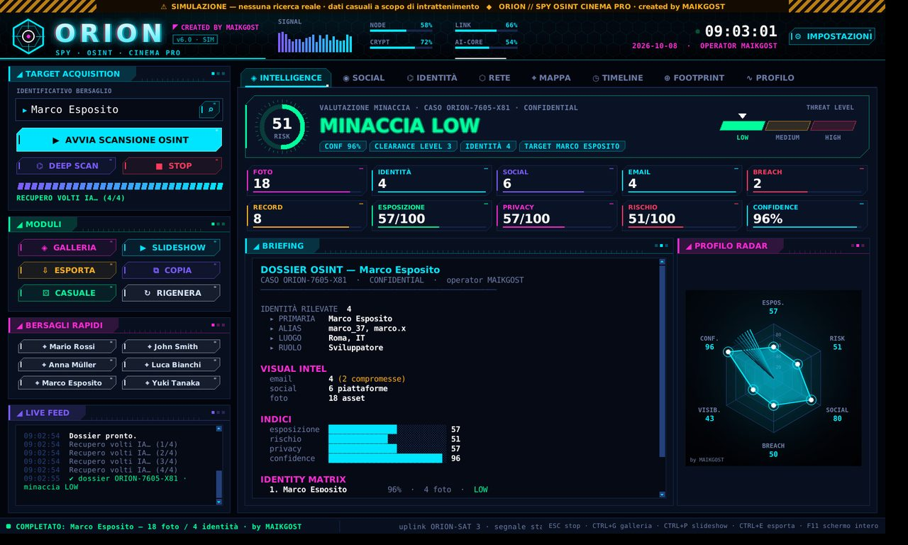
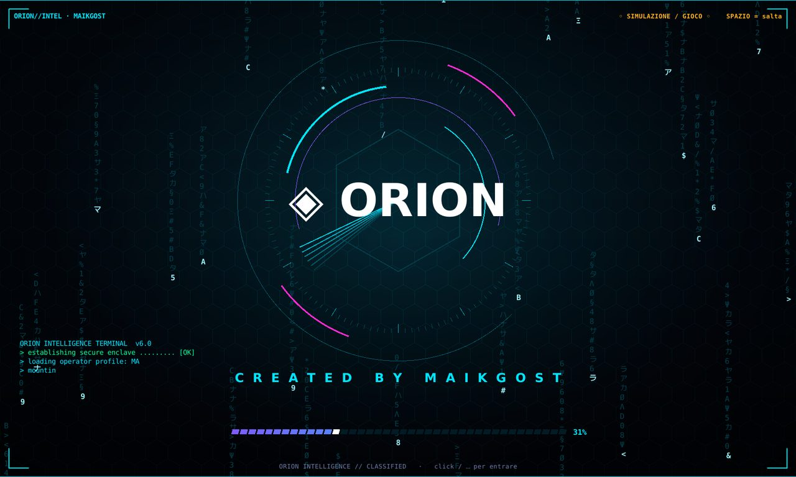
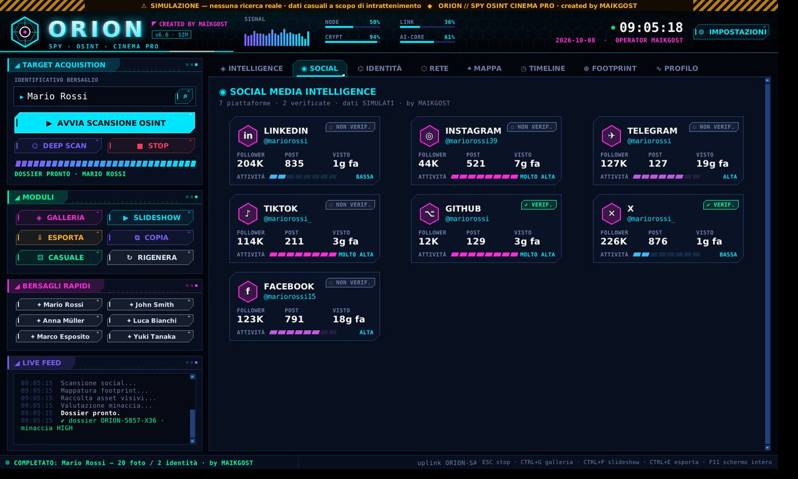
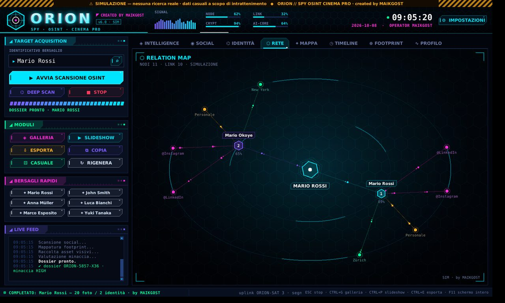
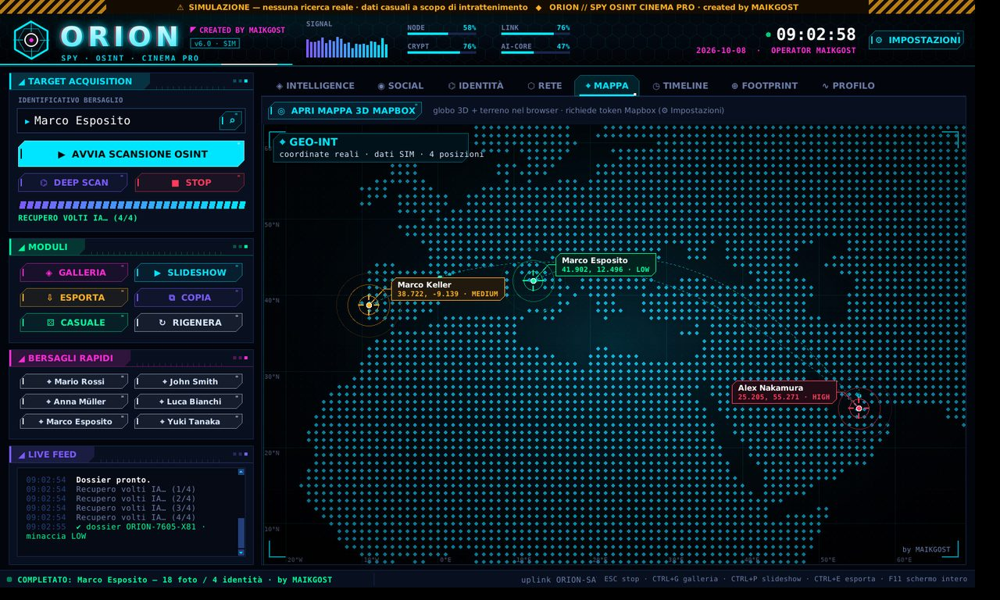
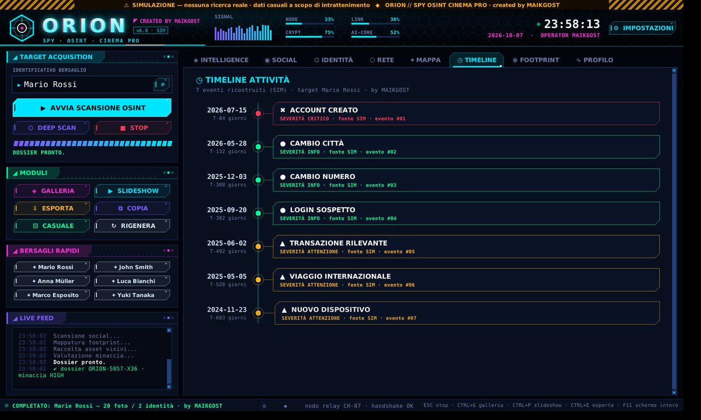
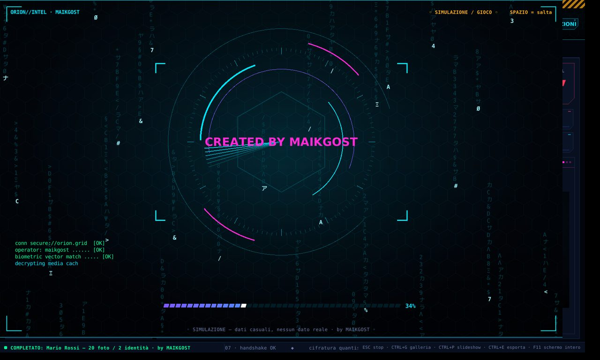
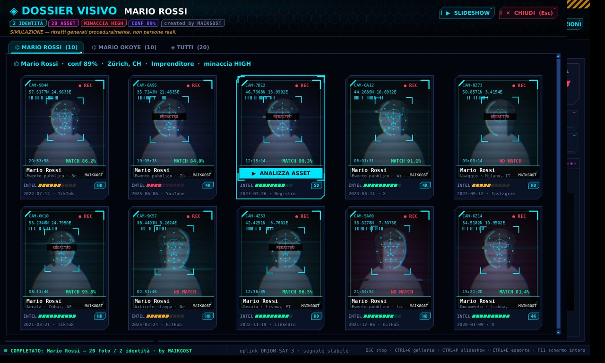
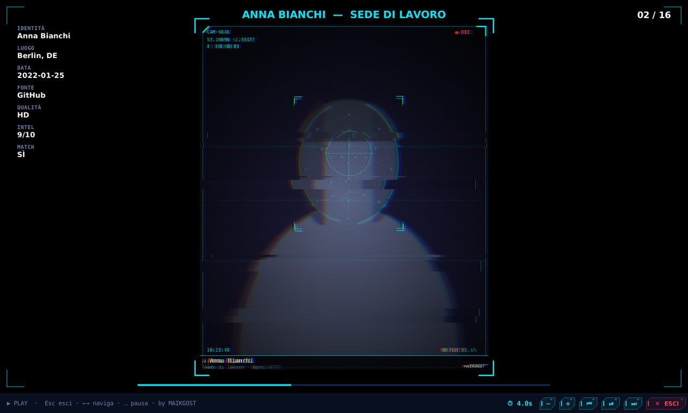

# ORION // SPY OSINT CINEMA PRO — by MAIKGOST

Gioco / demo d'interfaccia in stile "film di spionaggio": scrivi un nome e ORION
"costruisce" un dossier con identità, social, mappa, grafo delle relazioni,
timeline e galleria foto.

> ⚠️ **SIMULAZIONE.** Nessuna ricerca reale: tutti i dati sono generati a caso
> (in modo deterministico) dal testo digitato. I ritratti sono silhouette
> generate dal codice oppure volti creati da IA: **non sono persone reali**.



## Avvio

```bash
pip install Pillow            # obbligatorio
pip install opencv-python     # opzionale: video d'avvio personalizzato
python gf.py
```

Requisiti: Python 3.8+ con tkinter (incluso nell'installer ufficiale di Windows).

## Cosa c'è

- **Interfaccia HUD futuristica**: pulsanti neon con riflesso animato, pannelli
  olografici, schede con indicatore che scorre, notifiche animate, barra di stato
  con notiziario scorrevole, intestazione con equalizzatore e indicatori live.
- **Dossier**: anello di rischio, livello di minaccia luminoso, contatori animati,
  radar con fascio rotante, briefing con effetto "macchina da scrivere".
- **Social / Identità**: card per ogni piattaforma e per ogni identità (con ritratto).
- **Rete**: grafo animato target → identità → entità, con pacchetti dati.
- **Mappa**: mondo a punti (Natural Earth), rotte animate, ping, mirino col mouse;
  in più la mappa 3D Mapbox nel browser (serve un token gratuito).
- **Timeline**: eventi in sequenza con nodi colorati per gravità.
- **Galleria**: intro olografica, card con hover, scheda di dettaglio con
  scansione facciale (mesh dei punti del viso), slideshow con transizioni glitch.
- **Effetti sonori** sintetizzati (nessun file da scaricare) e **impostazioni**
  con interruttori, colore accento, durata intro, video d'avvio.

## Comandi rapidi

| Tasto | Azione |
|---|---|
| Invio | avvia la scansione |
| Esc | ferma la scansione / chiude le finestre |
| Ctrl+G | galleria |
| Ctrl+P | slideshow |
| Ctrl+E | esporta dossier (.txt + .json) |
| Ctrl+R | bersaglio casuale |
| F5 | rigenera (variante del dossier) |
| F11 | schermo intero |
| Ctrl+, | impostazioni |

## Schermate

| | |
|---|---|
|  |  |
|  |  |
|  |  |
|  |  |

## File creati dall'app

Accanto a `gf.py` vengono creati `orion_settings.json` (impostazioni, compreso
l'eventuale token Mapbox), `orion_cache.db` (cache dei dossier) e la cartella
`orion_faces/` (volti IA scaricati). Sono esclusi da git tramite `.gitignore`.

---
Creato da **MAIKGOST**.
