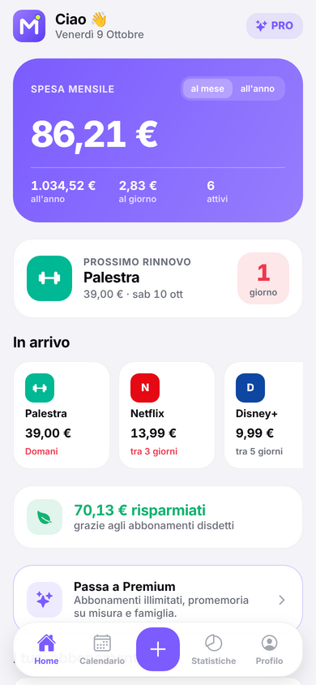
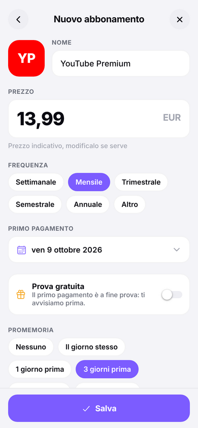
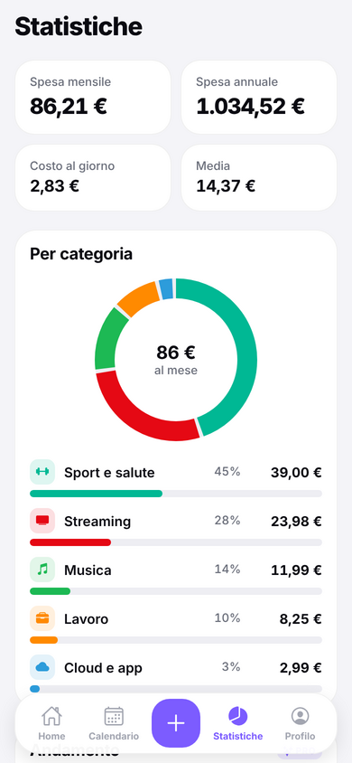
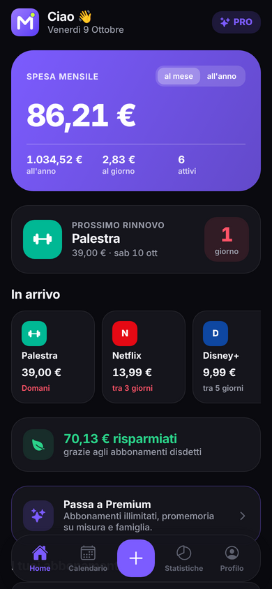

# Maik Subs

**Tutti i tuoi abbonamenti, sotto controllo.** App per iPhone e Android (React Native + Expo) che tiene traccia di Netflix, Spotify, palestra e di ogni spesa ricorrente, e ti avvisa prima di ogni rinnovo. Creata da Maik.

<p>
  
  
  
  
</p>

I dati restano sul telefono: nessun collegamento alla banca, nessun account, nessun server.

## Cosa fa

| Schermata | Contenuto |
| --- | --- |
| **Home** | Totale al mese / all'anno (con interruttore), costo al giorno, budget mensile con barra, prossimo rinnovo con conto alla rovescia, rinnovi dei prossimi 14 giorni, soldi risparmiati con le disdette, lista con ricerca, ordinamento (data, prezzo, nome) e filtro per categoria. |
| **Aggiungi** | Catalogo di 57 servizi già pronti (Netflix, Spotify, DAZN, palestra, bollette…) con prezzo indicativo, oppure nome scritto a mano. Prezzo, data, frequenza (settimanale, mensile, trimestrale, semestrale, annuale o "ogni N giorni/settimane/mesi/anni"). **3 tocchi**: `+` → Netflix → Salva. |
| **Calendario** | Vista mensile con i pallini dei rinnovi, totale del mese, elenco dei giorni con addebiti. |
| **Statistiche** | Grafico a ciambella per categoria, andamento a 12 mesi (previsione e storico), i più costosi, consigli di risparmio. |
| **Dettaglio** | Prossimi 5 rinnovi, quanto hai speso finora, storico prezzi (segnala gli aumenti), pagamenti passati, link per disdire, pausa / disdetta / elimina con "Annulla". |
| **Premium** | Abbonamenti illimitati (gratis fino a 8), più promemoria per rinnovo e orario a scelta, famiglia con divisione dei costi, storico e consigli completi, colore dell'app, export CSV. |
| **Profilo** | Tema chiaro/scuro/automatico, colore principale, lingua (IT/EN), 12 valute, budget, notifiche, famiglia, blocco con Face ID / impronta, backup JSON, import, export CSV, riepilogo da condividere. |

**Notifiche**: promemoria locali tipo *"Netflix si rinnova tra 3 giorni · 13,99 € · Mensile"*, e per le prove gratuite *"La prova di Disney+ termina domani. Disdici ora se non ti serve."* Toccando la notifica si apre l'abbonamento. Vengono riprogrammate automaticamente a ogni modifica (massimo 60, il limite di iOS è 64).

### In più rispetto all'idea iniziale

- Prove gratuite con avviso prima della fine
- Calendario dei rinnovi
- Budget mensile con barra di avanzamento
- "Risparmiati": quanto hai evitato di spendere grazie alle disdette
- Storico prezzi con avviso degli aumenti
- Pausa / disdetta senza cancellare lo storico
- Eliminazione con "Annulla"
- Blocco con Face ID / impronta
- Backup e ripristino (JSON), export CSV per Excel, riepilogo da mandare su WhatsApp
- Italiano e inglese, 12 valute
- Onboarding di 3 schermate
- Vibrazioni leggere (haptics) e animazioni su aggiunta, eliminazione e riordino

## Provarla subito sul telefono

Serve [Node.js](https://nodejs.org) 20 o più recente.

```bash
npm install
npx expo start
```

Inquadra il QR code con l'app **Expo Go** (iPhone o Android). Nel browser: `npx expo start --web`.

> I pagamenti RevenueCat richiedono una **development build** (in Expo Go l'app gira in modalità demo, con il Premium attivabile gratis per provarlo).
>
> ```bash
> npx eas-cli@latest build --profile development --platform android   # oppure ios
> ```

Comandi utili:

```bash
npm run typecheck   # TypeScript
npm run lint        # ESLint
```

## Pagamenti (RevenueCat)

Copia `.env.example` in `.env` e inserisci le chiavi pubbliche di RevenueCat:

```
EXPO_PUBLIC_REVENUECAT_IOS_KEY=appl_...
EXPO_PUBLIC_REVENUECAT_ANDROID_KEY=goog_...
```

Senza chiavi l'app funziona in **modalità demo**. Configurazione completa in [docs/PUBBLICAZIONE.md](docs/PUBBLICAZIONE.md).

## Struttura

```
src/
  app/                  schermate (Expo Router)
    (tabs)/             Home, Calendario, Statistiche, Profilo
    add.tsx             catalogo + modulo (anche modifica)
    subscription/[id]   dettaglio
    premium.tsx         paywall
    family.tsx          membri della famiglia
    onboarding.tsx      prima apertura
  components/           logo Maik, UI, grafici, calendario, barra in basso
  lib/                  date e rinnovi, importi, catalogo, notifiche,
                        acquisti, backup, traduzioni, tema
  state/app.tsx         stato globale salvato sul telefono
assets/brand/           logo Maik in SVG
assets/images/          icone app, splash, notifiche (generate dall'SVG)
docs/                   pubblicazione, privacy, testi per gli store
```

## Logo

Il logo è una **M** arrotondata bianca su sfondo viola sfumato, con un puntino lime: il promemoria che arriva prima di ogni rinnovo. I sorgenti sono in `assets/brand/` (SVG), il componente React è `src/components/MaikLogo.tsx`.

## APK Android con un doppio clic

In [`android/`](android/) c'è il progetto Android normale con l'app già dentro. Su Windows: doppio clic su `android/crea_apk.bat` e ottieni `MaikSubs.apk`, con notifiche vere anche ad app chiusa. Istruzioni in [android/README.md](android/README.md).

## Versione Python (APK con 3D)

In [`python-apk/`](python-apk/) c'è la stessa app scritta in Python con Kivy, con logo e grafici in 3D OpenGL, che si trasforma in APK con Buildozer o direttamente su GitHub Actions.

## Pubblicazione

Guida passo passo (account sviluppatore, RevenueCat, test chiuso su Google con 12 tester per 14 giorni, revisione): [docs/PUBBLICAZIONE.md](docs/PUBBLICAZIONE.md).
Testi per gli store in italiano e inglese: [docs/SCHEDA_STORE.md](docs/SCHEDA_STORE.md).
Informativa sulla privacy: [docs/PRIVACY.md](docs/PRIVACY.md).

---

© Maik
