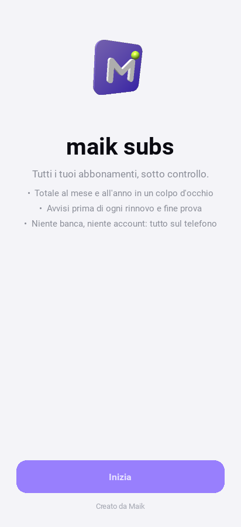
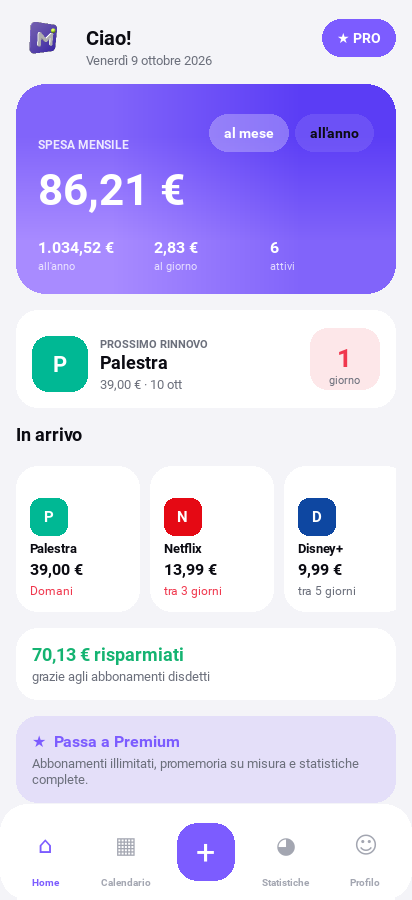
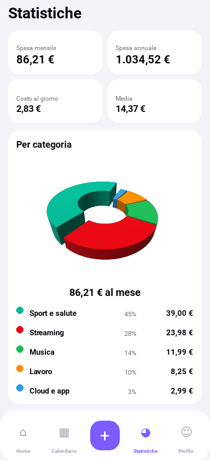
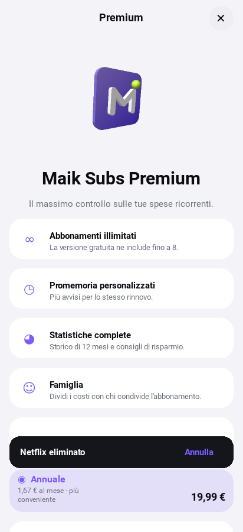

# Maik Subs, versione Python (Kivy) con 3D

La stessa app degli abbonamenti, scritta **tutta in Python** con [Kivy](https://kivy.org), trasformata in **APK Android** con [Buildozer](https://buildozer.readthedocs.io).

<p>
  
  
  
  
</p>

## Cosa c'è di 3D

Il 3D è vero, fatto in **OpenGL** con shader e luci (`gl3d.py`), non un effetto finto:

- **Logo Maik 3D**: la M in rilievo su una piastrella viola sfumata, con la pallina lime. Oscilla, galleggia e fa un giro completo all'avvio, in Premium e quando lo tocchi nella Home.
- **Grafico a ciambella 3D** nelle Statistiche: ogni categoria è una fetta in rilievo. Le fette crescono all'apertura, ruotano lentamente e la categoria più costosa è più alta e staccata.
- Tutto viene disegnato in un buffer con profondità e **supersampling 2x**, quindi i bordi restano lisci.

Animazioni dell'interfaccia:

- Le schede **si ribaltano** verso lo schermo quando compaiono
- I pulsanti rimbalzano quando li tocchi
- Il totale **conta** fino alla cifra giusta
- Le barre del grafico crescono
- Le schermate scorrono come carte
- Il toast con "Annulla" entra con uno zoom

## Schermate

| | |
| --- | --- |
| **Home** | Totale al mese / all'anno, al giorno, budget, prossimo rinnovo con conto alla rovescia, "In arrivo", risparmiati, lista con ricerca e ordinamento |
| **Aggiungi** | 32 servizi pronti (Netflix, Spotify, palestra, bollette…) oppure personalizzato. **3 tocchi**: `+` → servizio → Salva |
| **Calendario** | Mese con i pallini dei rinnovi e totale del mese |
| **Statistiche** | Ciambella 3D per categoria, andamento 12 mesi (futuri o passati), i più costosi, consigli |
| **Dettaglio** | Prossimi 5 rinnovi, speso finora, storico prezzi, pausa / disdetta / elimina con "Annulla" |
| **Premium** | Logo 3D, vantaggi, piani mensile / annuale / a vita |
| **Profilo** | Tema chiaro/scuro, valuta, budget, promemoria, dati di esempio, cancella tutto, "Creato da Maik" |

I dati sono salvati in un file JSON nella cartella privata dell'app: niente banca, niente account.

## File

```
main.py          app e schermate
gl3d.py          motore 3D OpenGL (logo e ciambella)
store.py         dati, calcolo rinnovi, salvataggio
test_store.py    test della logica (python -m unittest test_store)
buildozer.spec   configurazione dell'APK
assets/          icona e schermata di avvio
```

## 1. Provarla sul computer

```bash
pip install "kivy[base]" plyer
python main.py
```

## 2. Ottenere l'APK

### Strada facile: GitHub la compila per te

Il file `.github/workflows/build-apk.yml` compila l'APK su GitHub a ogni modifica in `python-apk/`.

1. Vai su GitHub → **Actions** → **Build APK (Python / Kivy)**. Puoi anche avviarla a mano con **Run workflow**.
2. Aspetta che finisca. La prima volta ci vogliono circa 20-30 minuti, poi è più veloce grazie alla cache.
3. Apri la build e scarica l'artifact **maik-subs-apk**: dentro c'è il file `.apk`.

### Sul tuo computer (Linux, oppure Windows con WSL)

Buildozer non funziona direttamente su Windows: usa WSL con Ubuntu.

```bash
sudo apt install -y python3-pip openjdk-17-jdk autoconf automake libtool libltdl-dev pkg-config \
  zlib1g-dev libncurses-dev cmake libffi-dev libssl-dev zip unzip git
pip install --upgrade buildozer "cython<3.1"

cd python-apk
buildozer -v android debug          # crea bin/maiksubs-1.0.0-...-debug.apk
```

La prima build scarica Android SDK e NDK (circa 3 GB) e richiede 20-40 minuti.

Con il telefono collegato via USB (debug USB attivo) puoi installarla e vedere i log così:

```bash
buildozer android deploy run logcat
```

### Installare l'APK sul telefono

Copia il `.apk` sul telefono, aprilo e consenti "Installa app sconosciute".

### Per Google Play

```bash
buildozer android release           # crea un .aab
```

Poi firma l'.aab con la tua chiave (keystore) e caricalo nella Play Console. Gli step per il test chiuso con 12 tester per 14 giorni sono in [../docs/PUBBLICAZIONE.md](../docs/PUBBLICAZIONE.md).

## Limiti di questa versione rispetto a quella Expo

- **Promemoria**: compaiono come notifiche quando apri l'app o quando torna in primo piano, per i rinnovi entro i giorni scelti. Non sono programmati in anticipo ad app chiusa: servirebbe codice Java (AlarmManager) dentro l'APK. La versione Expo (`../src`) invece programma le notifiche anche ad app chiusa.
- **Premium**: è in modalità demo, il pulsante lo attiva senza pagare. Per incassare su Google Play bisogna integrare Google Play Billing tramite pyjnius, oppure usare la versione Expo con RevenueCat.
- **Loghi dei servizi**: riquadri colorati con le iniziali (funzionano offline), non i loghi ufficiali.
- Solo italiano.

---

Creato da Maik.
